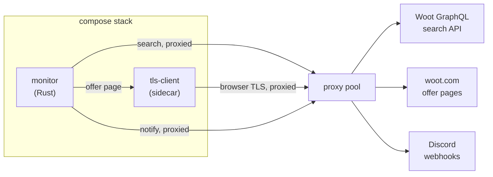

# High-Level Design: woot-monitor

## Problem

Woot.com lists thousands of concurrent offers and rotates them continuously. Good deals sell out in minutes, and the site provides no feed, alert, or notification of its own. Watching for a specific product — or for anything worth reselling — means refreshing a catalogue that is too large to read and changes faster than a person can track.

Woot also actively resists automated reading. Its offer pages reject clients whose TLS fingerprint does not resemble a real browser, and its search API is throttled per source address.

## Approach

Poll Woot's public GraphQL search on a short interval, diff each result against the offers already seen, and push anything new to Discord.

Three disciplines make that workable:

**Newest-first polling with a cutoff.** The catalogue is larger than the API will paginate, so a full sweep is both expensive and incomplete. Sorting newest-first and reading only back to the newest offer already recorded — less a margin — turns each poll into a few requests instead of fifty.

**Tiered routing.** Not every new offer is worth a notification. Offers are split by whether their product identity and review count could be established, and a separately configured watchlist catches specific keywords regardless of that split.

**Proxied and fingerprinted egress.** Every outbound request rotates through a proxy pool. Requests for offer pages — which Woot fingerprints — are forwarded through a sidecar that presents a browser TLS signature.

## Target Users

A single operator running the stack on their own server, who also consumes its output. They configure it once, deploy it as two containers, and read the Discord channels it feeds. They are technical enough to edit a TOML file and a compose file, but are not watching logs day to day — the system has to be legible from its Discord output alone.

Secondary: anyone subscribed to the Discord channels, who sees only the notifications and never the system.

## Goals

- A new offer reaches Discord within one poll interval of appearing on woot.com.
- Notifications carry enough context — title, price, condition, review count, product identity — to decide without opening the page.
- Keyword and ASIN matches are never suppressed, whatever else is known about the offer.
- Steady-state request volume stays within the proxy pool's budget.
- The whole stack deploys as two published images, with all deployment-specific values supplied at runtime.

## Non-Goals

- **Purchasing.** The system notifies; it never adds to cart or checks out.
- **Other retailers.** Woot's API, page structure, and fingerprinting are assumed throughout.
- **Durable history.** Seen offers live in memory. A restart re-reads the catalogue and treats it as the new baseline rather than replaying notifications.
- **Multi-tenancy.** One configuration, one set of webhooks, one operator.
- **A dashboard.** Discord is the interface. There is no UI, and adding one would displace the output channel rather than complement it.

## Tenets

- **Prefer a false alarm to a missed offer.** When a rule could be drawn tightly or loosely, draw it loosely — an extra notification costs a glance, a missed deal costs the deal.
- **Measure the upstream, do not assume it.** Woot's API is undocumented and changes without notice. Verify ordering, field nullability, and limits against the live service before depending on them.
- **Deployment values live in the environment, not the image.** One published image serves every deployment; anything that differs between them arrives at runtime.
- **Fail loudly on configuration, tolerantly but visibly on the network.** A missing or malformed config should stop the process. A failed request should be logged and retried rather than fatal — but a system that has stopped working must not keep reporting that it is fine.

## System Design

The monitor owns all decision-making. The sidecar is a dumb forwarder: it receives a URL, headers and a proxy, and returns the response body. It holds no state and knows nothing about offers.

Four segments divide the monitor's intent:

| Segment | Owns |
|---|---|
| **detection** | Polling cadence, catalogue ordering, the cutoff that bounds each poll, and deciding what counts as new |
| **routing** | Which channels an offer reaches, watchlist matching, and Discord delivery |
| **fetching** | Proxy rotation, the sidecar contract, and page scraping |
| **config** | What is configurable, where each value comes from, and how a bad configuration fails |

## Key Design Decisions

**A sidecar for TLS fingerprinting, not an in-process library.** Woot's offer pages reject default TLS stacks. The mature implementations are Go libraries with no Rust equivalent, so the choice was a sidecar process or a rewrite. A sidecar costs a second image and a network hop, and confines the dependency behind an HTTP contract. Rejected: reimplementing fingerprinting in Rust (large, fragile, and unrelated to the problem).

**Poll and diff, rather than any push mechanism.** Woot publishes no feed, webhook, or change stream. Polling is the only available mechanism; the design question is only how often and how much.

**Bound each poll by offer date, not by recognising known offers.** Woot lists in batches that share a timestamp, and an offer's position within its batch is arbitrary — so a poll that stopped at the first already-seen offer would step over new ones sitting behind it. Stopping on a date cutoff instead is sound because the ordering is strictly monotonic. Rejected: stopping at the first known offer (unsound), and re-reading the whole catalogue each poll (correct but wasteful).

**Read past the cutoff by a margin.** Offers can appear carrying a start date earlier than one already recorded, so a cutoff drawn exactly at the newest known offer would miss them. The margin trades requests for coverage, consistent with preferring a false alarm to a missed offer.

**Keep seen offers in memory.** Persistence would let the monitor replay missed notifications after downtime, but Woot's catalogue turns over fast enough that a restart's backlog is mostly stale. In-memory state keeps the deployment to two stateless containers with no volume to manage. Consequence: a restart notifies nothing until the next genuinely new offer.

**Split configuration by what it belongs to.** Webhook endpoints, keywords and ASINs describe *what the operator wants* and live in a config file. Addresses, credentials and cadence describe *where this instance runs* and come from the environment. Neither is baked into an image.

## Success Metrics

- Offers visible on woot.com appear in Discord within one poll interval. Falsified by any offer found on the site that never reached a channel.
- Watchlist keywords fire on titles a reader would say match them. Falsified by a configured keyword that never produces a notification while matching products are listed.
- Steady-state request count stays within the proxy pool's budget. Falsified by proxy rate-limit errors during ordinary operation.
- A deployment can change any operational value without rebuilding an image. Falsified by any change that requires a new image to take effect.

## References

- [bogdanfinn/tls-client-api](https://github.com/bogdanfinn/tls-client-api) — the sidecar's upstream.
- `docs/intent/` — the four segment designs and their specs.
